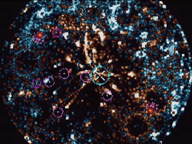

# RP6502 Galaxy Simulator 🌌

A chaotic attractor simulation and biological galaxy defense game running on the [RP6502 Picocomputer](https://github.com/picocomputer/rp6502).



## 1. The Simulation 🌀
The core visual is a **strange attractor** mathematical system, inspired by a generative art algorithm.
*   **Math**: The system iterates $x$ and $y$ coordinates through a feedback loop involving sine and cosine waves:
    ```python
    u = sin(i+y) + sin(r*i+x)
    v = cos(i+y) + cos(r*i+x)
    x = u + t
    y = v
    ```
*   **Visuals**: 
    *   **Gold Stream**: Hydrogen-rich matter (particles $i < N/2$).
    *   **Cyan Stream**: Oxygen-rich matter (particles $i \ge N/2$).
    *   **Rendering**: Uses a 3x3 blur accumulation buffer to create soft, glowing trails that decay over time.

## 2. The Threat: Enemies 👾
**Red/Orange Entities** that orbit the galaxy center.
*   **Behavior**:
    *   **Keplerian Orbits**: They follow elliptical paths around the core with random eccentricity.
    *   **Respawn**: When destroyed, they respawn after **5 seconds** in a random "Safe Zone" on screen.
*   **Effect**: 
    *   **Infection**: They release a viral agent (Radius 16) that turns matter into cold **Cyan/Blue** trails.
    *   The goal is to prevent the entire galaxy from turning blue.

## 3. The Defense: Workers 🛡️
You can spawn workers to protect the galaxy. Workers also follow Keplerian orbits but can be directed by the player.

### Controls 🖱️
*   **Aim**: Move the reticle.
*   **Spawn**: Click to release a worker.
*   **Reset**: Press **START** to clear the board and restart the game.
*   **Orbit Control**:
    *   **Direction**: The worker spawns at the **Apocenter** (farthest point) aligned with your click. It will fall inward.
    *   **Shape**: The **Reticle Pulses**. 
        *   Small Reticle -> **Circular Orbit**.
        *   Large Reticle -> **Elliptical Orbit**.

### Worker Types
*   **Guardians (Cyan)**: 
    *   **Role**: Fighter / Kamikaze.
    *   **Ability**: Upon collision, it **destroys the worker/enemy AND itself**. Use them to clear threats.
*   **Gardeners (Magenta)**:
    *   **Role**: Healer.
    *   **Ability**: Emits a healing field (Radius 8) that restores particles to **Gold/Pink**.
    *   **Limit**: You can have a maximum of **7 Gardeners** active at once.

## Technical Details 🛠️
*   **Platform**: RP6502 (6502 CPU + Raspberry Pi Pico VGA).
*   **Language**: C (LLVM-MOS SDK).
*   **Physics**: Custom 8-bit/16-bit fixed-point physics engine.
    *   Zero floating-point math.
    *   Keplerian orbital mechanics with $1/r$ velocity scaling.
    *   Rotated geometric orbits.
